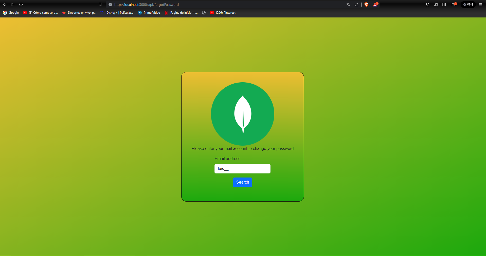
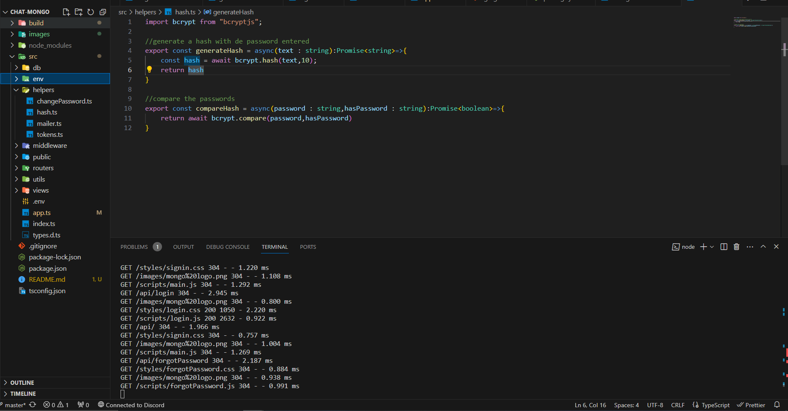
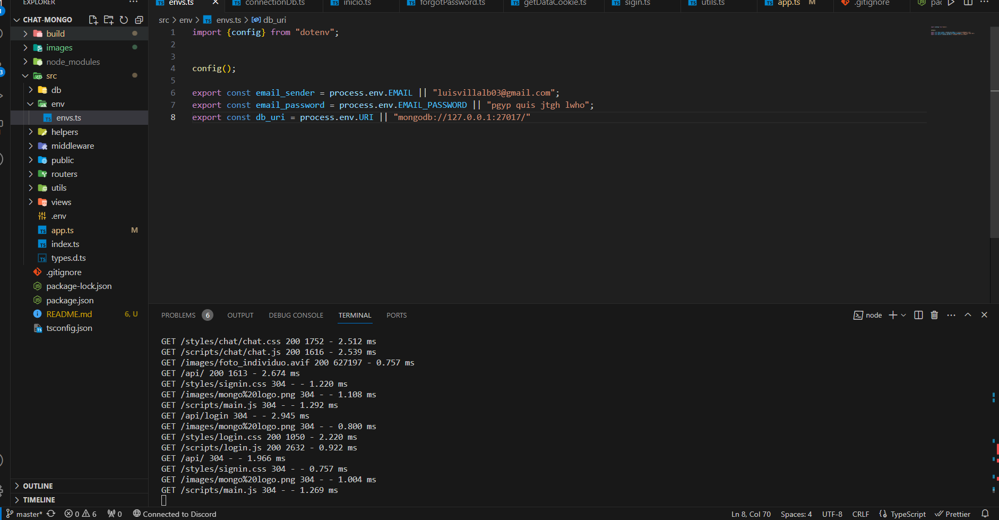
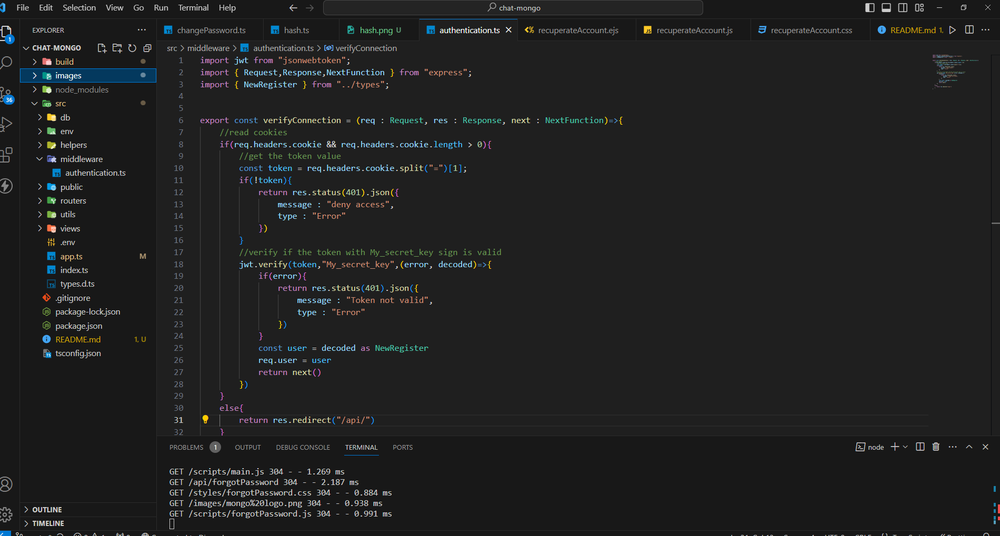

# Chat in real time

En este chat podras hablar libremente con varios usuarios.

Para llevarla a cabo utilize teconologia como:

- [TypeScript](https://www.typescriptlang.org/)
- [Node.js](https://nodejs.org/es)
- [JSONWebToken](https://jwt.io/)
- [NodeMailer](https://nodemailer.com/)

Entre otras mas.

------------

## Tabla de contenidos

- [Comenzar](#comenzar)
  - [#Instalar](#instalar)
- [Registrarse](#registrarse)
- [IniciarSesion](#iniciar-sesion)
- [RecuperarCuenta](#recuperar-cuenta)
- [Detalles](#detalles)
  - [Contraseñas](#contraseñas)
  - [MailAndDb](#mail-uri)
  - [Autenticacion](#autenticacion)

------------

### comenzar

#### instalar

Para comenzar primero deberas de clonar el repositorio corriendo en tu terminal el siguiente comando.

`git clone https://github.com/LuisVillalba1/Chat-mongo`

Una vez clonado el repositorio deberas de instalar todas las dependencias y ejecutar en tu terminal.

`npm run start`

------------

### Registrarse

Primero deberas de registarte antes de poder acceder a la app.

------------

### iniciar-sesion

Posteriormente al registrarse, podran acceder a la app con el mail y contraseña realizada.

------------

#### recuperar-cuenta

A la hora de recuperar una cuenta el usuario debera de ingresar el mail con el cual se registro, posteriormente recibira un mail en su cuenta.
El correo electronico contra con un link en el cual el usuario podra ingresar y cambiar su contraseña.

------------

### detalles

#### contraseñas

A la hora de registrarse almacenaremos crearemos un hash para la contraseña ingresada por parte del usuario.
Y cuando el usuario desee iniciar sesion compararemos la contraseña ingresada con la de la base de datos.

#### mail-uri

A la hora de trabajar con api podras modificar el mail que envia los mails para recuperar las cuentas asi como su password y la uri para poder acceder a la base de datos mongodb.

#### autenticacion

Utilizando jwson web token verificaremos si al querer ingresar al chat el usuario inicio sesion o no.
Cada ves que el usuario inicie sesion enviaremos una cookie que le permitira ingresar a su cuenta sin tener que iniciar sesion previamente, la cual tiene como duracion unos 30 dias.
[EOF]
